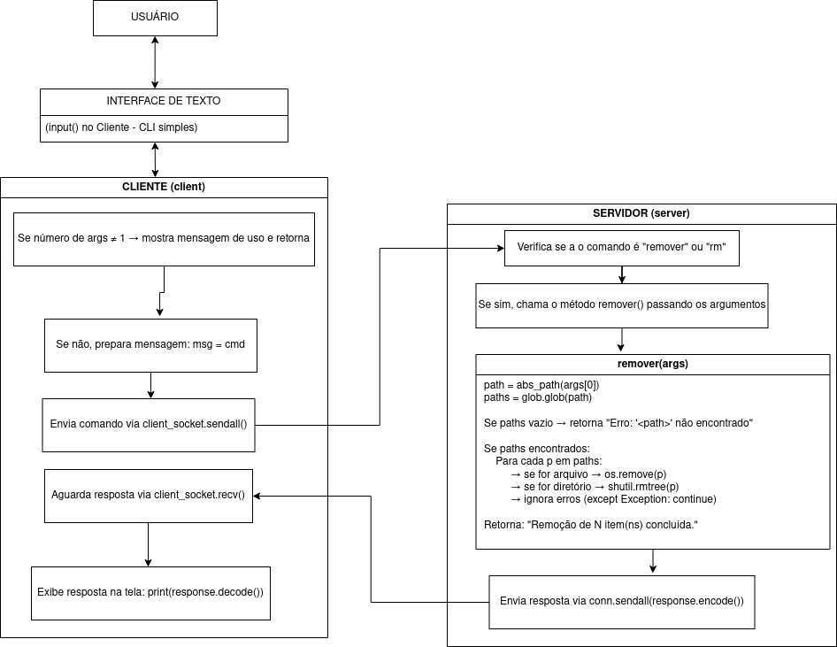
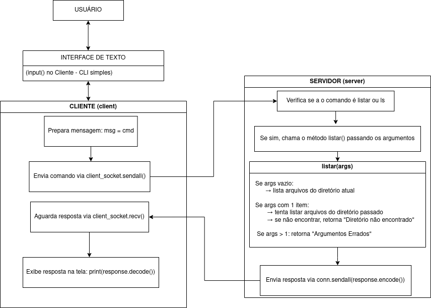

# Projeto Cliente-Servidor em Python

Este é um projeto de **Cliente-Servidor** em Python utilizando **sockets TCP/IP**. O servidor irá atuar no caminho **~/tmp/SERVER** e oferece funcionalidades básicas como:

- Listar arquivos
- Baixar arquivos do servidor para o cliente
- Enviar arquivos do cliente para o servidor
- Remover arquivos/diretórios
- limpar o prompt
- Encerrar a conexão

---


## Estrutura do Projeto

```
projeto_socket/
│
├── client.py       # Código do cliente
├── server.py       # Código do servidor
└── README.md       # Documentação do projeto
```

---

## Como Executar

### 🔹 Passo 1: Inicie o servidor

```bash
python3 server.py
```

O servidor escutará por conexões na porta `5000` por padrão.

### 🔹 Passo 2: Em outro terminal, execute o cliente

```bash
python3 client.py
```

---

## Comandos disponíveis no cliente

O cliente aceita uma série de comandos interativos:

| Comando                    | Descrição                                                                |
|----------------------------|---------------------------------------------------------------------------|
| `listar` ou `ls`           | Lista os arquivos do diretório atual no servidor                          |
| **ls diretorio**           | Lista os arquivos de um diretório específico                              |
| `copy` ou `cp`             | Envia um ou mais arquivos do cliente para o servidor                      |
| **cp origem dest**         | Copia múltiplos arquivos para o diretório destino no servidor             |
| `get` ou `baixar`          | Baixa um arquivo do servidor para o cliente                               |
| **get nome_arquivo.txt**   | O arquivo será salvo como `baixado_nome_arquivo.txt` no cliente           |
| `remover` ou `rm`          | Remove um arquivo ou diretório no servidor                                |
| **rm nome.txt**            | Remove o arquivo `nome.txt` do servidor                                   |
| `clear`                    | Limpa o terminal                                                          |
| `help`                     | Mostra a ajuda dos comandos                                               |
| `exit`                     | Encerra a conexão com o servidor                                          |

---

## Exemplo de Envio de Arquivos para o Servidor

```bash
cp arquivo1.txt arquivo2.txt destino/
```

> Envia os arquivos `arquivo1.txt` e `arquivo2.txt` para o diretório `destino/` no servidor.

> Se o diretório `destino/` não existir no servidor, é criado automaticamente.


---

## Exemplo de Download de Arquivo

```bash
get arquivo.txt
```

> Salvará o arquivo como `baixado_arquivo.txt` no diretório atual do cliente.

> Se o arquivo `baixado_arquivo.txt` já existir no cliente, o download será cancelado.


---

## Exemplo de Remoção

```bash
rm meu_arquivo.txt
```

> Remove o arquivo no servidor.

```bash
rm pasta/*
```

> Remove todos os arquivos dentro da pasta no servidor.



---

## Exemplo de Listar

```bash
ls diretorio/
```
> Lista os arquivos dentro do diretório `diretorio/` no servidor.



---